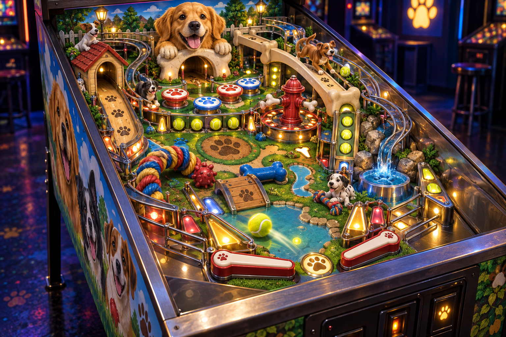
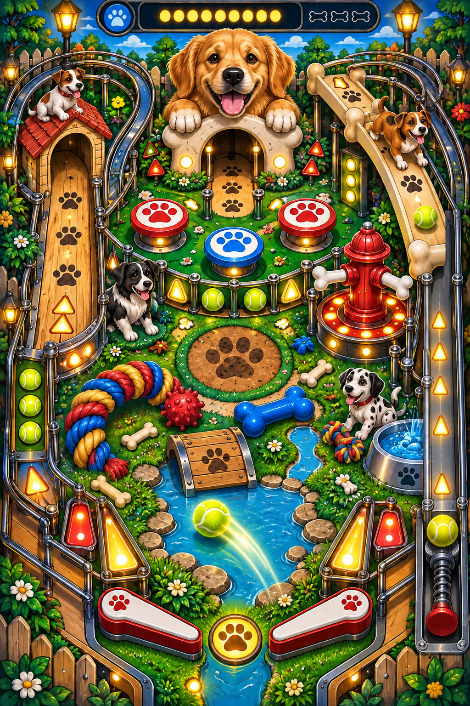

# Pinball Neo 95

## Game concept

**Pinball Neo 95** is an original 2D arcade pinball game inspired by the fun, colorful feeling of classic 1990s PC pinball games.

The table is dog-themed, and the ball is a bright fuzzy tennis ball. The player launches the ball through a playful dog park filled with paw-print bumpers, dog-bone ramps, a doghouse lane, a fire-hydrant spinner, tennis-ball targets, chew toys, and a water-bowl feature.

This should be a spiritual successor, not a copy of any existing game. Use original names, artwork, sounds, music, table layout, code, and branding.

## Concept images

### 3D table reference

### 2D gameplay reference with right-side launcher

## Development plans

- [Game development plan](GAME_PLAN.md)
- [Sprite and art plan](SPRITE_PLAN.md)
- [Testing and improvement plan](TESTING_PLAN.md)

## Recommended development approach

Build the first playable version as a 2D game. Godot, Unity, or another game engine can work. The important part is reliable physics and a readable table, not advanced 3D graphics.

### 1. Create the playfield

- Make a tall portrait game screen.
- Add solid outer walls and sloped guides.
- Leave space for two flippers at the bottom.
- Add a separate vertical launcher lane on the right side.
- Add a spring-loaded plunger at the bottom of the launcher lane.

### 2. Build the tennis-ball physics

- Use a circular rigid-body ball.
- Give it a bright yellow tennis-ball texture with white curved seams.
- Tune gravity, bounce, friction, and collision response until the ball feels fast but controllable.
- Prevent the ball from getting stuck in corners or inside bumpers.
- Add a drain area below the flippers that removes the ball and costs a life.

### 3. Add the main table objects

- Paw-print bumpers: bounce the ball and award points.
- Bone ramps: route the ball to different areas of the table.
- Doghouse lane: award a bonus for completing the paw-print targets.
- Fire hydrant spinner: awards points for every rotation.
- Tennis-ball targets: light up one at a time or in sequence.
- Water bowl: activate a temporary bonus or ball-save feature.
- Chew toys: act as visual obstacles and smaller scoring targets.

### 4. Add game rules

Start with a simple ruleset:

1. Player begins with three tennis balls.
2. Launch the ball with the right-side plunger.
3. Keep the ball in play with the flippers.
4. Complete target groups to activate missions.
5. Award multiball after completing several missions.
6. Display score, high score, balls remaining, and active bonuses.

### 5. Add the user interface

- Score at the top.
- Ball counter and multiplier.
- Mission or bonus indicator.
- Clear launch and ball-save feedback.
- Pause, restart, settings, and accessibility options.

Keep the UI simple so the playfield remains the focus.

### 6. Create original art and audio

Make or commission original assets. Do not copy assets from 3D Pinball: Space Cadet, Microsoft Windows, Full Tilt! Pinball, or another game.

Create:

- Dog and puppy illustrations
- Paw-print and bone graphics
- Tennis-ball sprites and animations
- Original bumper and ramp artwork
- Flipper and plunger animations
- Bark, squeak, bounce, and arcade sound effects
- Original background music

### 7. Build a small prototype first

The first milestone should contain only:

- One tennis ball
- Two flippers
- The right-side launcher
- Outer walls
- Three bumpers
- One scoring target
- A drain and restart button

Once this feels fun, add the dog-themed features one at a time.

### 8. Test and polish

Test different screen sizes and keyboard controls. Recommended starting controls are:

- Left flipper: `Z` or left arrow
- Right flipper: `/` or right arrow
- Launch: Space or Enter
- Pause: Escape

Make sure the game is playable with keyboard, controller, and—if practical—touch input.

## Publishing plan

When the game is stable, package it for Windows and test the installer. For Microsoft Store submission, use original or properly licensed content, provide a privacy policy if the game collects user data, and submit the game for certification.

The current build's data behavior is documented in [PRIVACY_POLICY.md](PRIVACY_POLICY.md).

Physical-device release checks are documented in [DEVICE_QA_RUNBOOK.md](DEVICE_QA_RUNBOOK.md).

Publishing copy and the screenshot shot list are in [STORE_LISTING.md](STORE_LISTING.md), with build history in [CHANGELOG.md](CHANGELOG.md).

Run `game_app/tool/build_release.ps1` from PowerShell to analyze, test, build, and audit the release targets in one pass.

The Play Store bundle is written to `game_app/build/app/outputs/bundle/release/app-release.aab`.

Production signing steps are documented in [SIGNING_GUIDE.md](SIGNING_GUIDE.md); no signing secrets are stored in this workspace.

Dependency license notices are archived in [release_legal/THIRD_PARTY_NOTICES.txt](release_legal/THIRD_PARTY_NOTICES.txt), with regeneration details in [release_legal/DEPENDENCY_LICENSE_MANIFEST.txt](release_legal/DEPENDENCY_LICENSE_MANIFEST.txt).

Release binary checksums are generated in [release_legal/RELEASE_SHA256SUMS.txt](release_legal/RELEASE_SHA256SUMS.txt) by the release pipeline.

The GitHub Actions instructions for an unsigned iOS test IPA are in [IOS_UNSIGNED_BUILD.md](IOS_UNSIGNED_BUILD.md).

Hosted Flutter CI runs analysis and the complete test suite on pushes and pull requests targeting `main`.

Possible business models:

- Free demo with a paid full version
- Low-cost one-time purchase
- Free game with optional cosmetic table themes
- Paid game with no advertisements

## First development checklist

- [ ] Choose the game engine
- [ ] Create a blank portrait playfield
- [ ] Implement tennis-ball movement and collisions
- [ ] Add left and right flippers
- [ ] Add the right-side launcher and plunger
- [ ] Add drain, lives, and restart logic
- [ ] Add three paw-print bumpers
- [ ] Add score and high score
- [ ] Replace placeholder shapes with original dog artwork
- [ ] Add sound effects and music
- [ ] Test on Windows
- [ ] Prepare a Store-ready build
